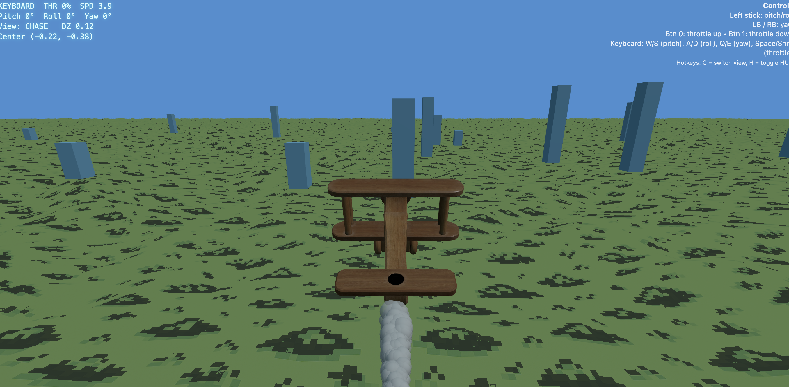

# Cloudart

A simple 3D flight demo built with [Three.js](https://threejs.org/).  
Supports both **keyboard** and **gamepad** controls.



## ✈️ Controls

**Keyboard**
- `W / S` → Pitch up / down  
- `A / D` → Roll left / right  
- `Q / E` → Yaw left / right  
- `Space` → Throttle up  
- `Shift` → Throttle down  
- `C` → Toggle view (Chase / Ground)  
- `H` → Toggle HUD  
- `T` → Toggle smoke  

**Gamepad**
- Left stick → Pitch / Roll  
- LB / RB or Triggers → Yaw  
- Button 0 → Throttle up  
- Button 1 → Throttle down  

## Setup

```bash
# Run a local server (example with Python)
python3 -m http.server 8000

go to 
localhost:8000